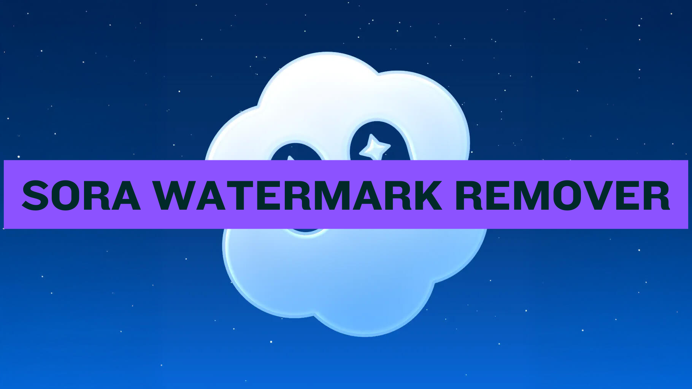

# 🎬 Sora2 水印去除工具

**基于 AI 的视频水印去除软件**



---

## 📋 目录

- [项目简介](#项目简介)
- [核心功能](#核心功能)
- [技术栈](#技术栈)
- [工作原理](#工作原理)
- [快速开始](#快速开始)
- [使用指南](#使用指南)
- [技术实现](#技术实现)
- [常见问题](#常见问题)
- [开源协议](#开源协议)
- [联系与支持](#联系与支持)

---

## 🌟 项目简介

**Sora2 水印去除工具** 是一款基于人工智能和计算机视觉的本地应用，用于自动检测并去除 Sora 视频中的水印。  
它结合了深度学习模型与优化的图像修复算法，能够提供高质量、自然的去水印效果。

### 为什么选择 Sora2？

- 🎯 **AI 智能检测**：自动识别“Made with Sora”等水印区域  
- 🖱️ **手动控制**：内置交互式蒙版编辑器，可手动调整识别区域  
- ⚡ **快速处理**：优化的算法结构，处理速度更快  
- 🎨 **自然无痕**：AI 修复算法保证画面平滑自然  
- 🔒 **安全可靠**：数据本地处理，不上传任何视频文件  

---

## ✨ 核心功能

### 基础功能

- 🎭 **AI 水印检测**：自动识别水印位置  
- ✏️ **蒙版编辑**：可视化编辑水印区域  
- 🎬 **多格式视频支持**：支持 MP4、MOV、MKV、WebM 等主流格式  
- 💾 **本地存储**：结果自动保存至用户目录  
- 🌍 **多语言界面**：支持中文、英文等多语言切换  
- 📱 **自适应设计**：兼容桌面与笔记本分辨率  

### 高级功能

- 🔍 **实时预览**：处理前可预览效果  
- ⚙️ **批量处理**：可同时去除多个视频的水印  
- 💡 **任务队列**：后台顺序执行处理任务  
- 🧩 **自定义参数**：支持调整修复强度、算法级别等参数  

---

## 🛠️ 技术栈

### 前端
- **框架**：Next.js + TypeScript  
- **UI 组件**：Radix UI + Tailwind CSS  
- **画布编辑**：React Konva  
- **状态管理**：React Hooks + Context API  
- **国际化**：next-intl  

### 后端
- **数据库**：PostgreSQL（通过 Drizzle ORM 管理）  
- **认证系统**：NextAuth  
- **存储**：本地文件或 Cloudflare R2（可选）  
- **AI 引擎**：ComfyUI 工作流（视频修复处理）  

### 基础设施
- **部署方式**：本地 / 服务器自建  
- **日志系统**：内置运行日志与错误追踪  
- **性能监控**：任务状态与处理耗时可视化  

---

## 🔬 工作原理

### 视频处理流程

```

视频上传 → 蒙版绘制 → 蒙版生成 → 提交AI模型 → 视频修复 → 导出结果

````

### 技术工作流

1. **视频上传**：选择或拖拽视频文件  
2. **水印标记**：使用画布标注水印区域  
3. **生成蒙版**：系统将选区生成蒙版图像  
4. **AI 修复**：模型分析并修复指定区域  
5. **视频导出**：生成无水印版本，保存到本地  

---

## 🚀 快速开始

### Windows
- 从 [发布页面](../../releases) 下载最新的 `.exe` 安装程序或 `.zip` 压缩包
- 两个包都包含所有依赖项，包括 FFmpeg
- 运行安装程序或解压 `.zip` 并运行 `sora-remover.exe`

### 环境要求

- Node.js 18 或更高版本  
- PostgreSQL 数据库（可选）  
- ComfyUI 处理服务（AI 修复部分）  

---

## 📖 使用指南

### 用户操作

1. 打开应用界面
2. 点击“上传视频”并选择要处理的视频文件
3. 使用鼠标标记水印区域
4. 点击“去除水印”按钮
5. 稍等片刻后下载无水印版本的视频

---

## 🧪 技术实现

* **AI 识别**：利用深度学习模型定位水印区域
* **修复算法**：通过 U-Net 架构实现高质量图像修复
* **队列系统**：任务排队执行，避免 GPU 过载
* **性能优化**：懒加载、CDN 缓存、数据库索引加速查询

---

## ❓ 常见问题

**问：使用这个工具是否安全？**
答：所有视频处理都在本地完成，不会上传或保存到云端。

**问：可以处理哪些格式？**
答：支持 MP4、MOV、MKV、WebM 等主流视频格式。

**问：处理速度如何？**
答：15 秒视频平均处理 3–5 分钟，具体视显卡性能而定。

**问：可以处理 4K 视频吗？**
答：可以，但耗时较长，建议使用 1080p。

**问：是否支持批量处理？**
答：支持，可同时添加多个视频到队列中自动执行。

---

## 📄 开源协议

本项目采用 **MIT 协议**，可自由使用、修改与分发。
使用时请保留版权信息。

---

## 📞 联系与支持

* **问题反馈**：请在项目的 Issues 区提交问题或建议

---

<div align="center">

**由 Sora2 团队用 ❤️ 打造**
感谢所有测试者与贡献者的支持

[⬆ 返回顶部](#sora2-水印去除工具)

</div>

